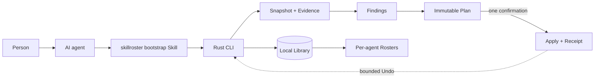

<h1 align="center">SkillRoster</h1>

<p align="center">
  <a href="README.md">中文</a> · <strong>English</strong>
</p>

<p align="center">
  <strong>Stop giving every agent every Skill.</strong>
</p>

<p align="center">
  SkillRoster inventories Skills scattered across your agents,<br>
  keeps the right defaults for each one, and leaves the rest searchable on demand.<br>
  File changes are previewed first and reversible afterward. One library. The right roster for every agent.
</p>

<p align="center">
  <a href="https://github.com/tt-a1i/skillroster/releases/latest"></a>
  <a href="https://github.com/tt-a1i/skillroster/actions/workflows/ci.yml"></a>
  <a href="https://github.com/tt-a1i/homebrew-skillroster"></a>
  <a href="https://www.rust-lang.org"></a>
  <a href="LICENSE"></a>
</p>

<p align="center">
  <a href="#start-in-30-seconds">Install</a> ·
  <a href="#what-it-sees">See it work</a> ·
  <a href="#how-it-works">How it works</a> ·
  <a href="docs/product-spec.md">Product spec</a> ·
  <a href="docs/installation.md">All platforms</a>
</p>

---

## More Skills should not mean more agent clutter

Skills accumulate across Codex, Claude Code, Pi, OpenCode, Hermes, Cursor,
Gemini CLI, and GitHub Copilot. The same capability gets copied into several
directories, versions drift, links break, and identical names hide different
content. Narrow Skills stay in every default context, making the right capability
harder to select.

Manual cleanup is risky too. It is hard to distinguish unused Skills from Skills
whose use was simply not observed, or to know whether a move, replacement, or
deletion can be recovered. SkillRoster establishes local facts first, then lets
the agent propose a Plan. It does not change agent files without that complete
Plan and your confirmation.

| See clearly | Configure precisely | Change reversibly |
| --- | --- | --- |
| Inventory Skills, placements, links, sources, exposure, and bounded usage evidence. | Keep the right Core Skills for each agent and leave narrower ones searchable On-demand. | Preview immutable Plans, require confirmation, record Receipts, and Undo owned changes. |

> **Core value: turn a multi-agent Skill estate from invisible and uncontrolled into something you can see clearly, configure precisely, and change reversibly.**

It is **not** another marketplace, model, or MCP server. The AI agent interprets
your intent; SkillRoster supplies bounded facts and executes approved changes.

### The governance result at a glance

On the same deterministic 120-Skill inventory, the public CLI acceptance path
actually runs Scan, Report, Plan, Apply, and Undo instead of loading prepared
results:

| Controlled arm | Default exposure | Duplicate placements | Verifiable recovery |
| --- | ---: | ---: | --- |
| Unmanaged | 200 | 80 | None |
| Careful manual governance | 64 | 10 | No Receipt |
| After SkillRoster Apply | **36** | **0** | Receipt verified; Undo restored the Agent tree byte-for-byte (200 / 80) |

This shows that SkillRoster can reduce default exposure, remove duplicate
placements in this inventory, keep On-demand retrieval, and bind the change to
a verified, reversible Receipt. The complete three-arm procedure, including the
careful-manual control, is in the [repeatable acceptance record](docs/acceptance.md#executed-three-arm-value-comparison).

This is controlled-inventory product evidence. It does not prove token or labor
savings, production performance, model quality, or universally superior Core
and On-demand choices.

## Start in 30 seconds

Install the current release with Homebrew:

```bash
brew install tt-a1i/skillroster/skillroster
skillroster --version
```

Then ask your agent:

> Use SkillRoster to inspect my local Skills, explain the biggest problems, and
> propose a safer setup. Do not change files until I approve the complete Plan.

Or begin directly in the terminal:

```bash
skillroster scan --summary
skillroster report
```

Agents add `--json` for one stable machine-readable document. Release archives,
Cargo installation, Windows instructions, and checksum verification are in the
[installation guide](docs/installation.md).

## What it sees

This is a real read-only v1.8.28 dogfood result from one changing local estate,
not a benchmark or a universal inventory size:

```text
SkillRoster · Report

  Independent Skills     252
  Placements             892
  Default exposure       525
  Observed-use Agents    3
  Session sample         sampled 5/8 · complete 0/8

  Top Findings
  high    layout     Skill links escape an approved root
  medium  exposure   Large default Rosters need review
  medium  overlap    Exact duplicate Skill placements

Read-only · no Agent files changed
Review evidence before planning changes
```

The important part is not the large numbers. It is the boundary: SkillRoster
reports incomplete coverage instead of turning missing observations into an
“unused” claim. See the full [release acceptance record](docs/acceptance/release-v1.8.28-candidate.md).

## How it works



Three ideas keep the model simple:

| Concept | Meaning |
| --- | --- |
| **Library** | The complete logical collection of known local Skills. |
| **Roster** | The curated view exposed to one agent; it is not another copy of the Library. |
| **On-demand Skill** | A valid Skill omitted from default exposure but retained for local search and exact loading. |

The primary caller is an agent. Semantic judgment stays with the model; identity,
filesystem boundaries, persistence, validation, and mutation stay with the CLI.

## The Agent-facing loop

```bash
# Observe
skillroster scan --summary --json
skillroster report --findings --limit 20 --json

# Retrieve one complete, fingerprint-verified Skill
skillroster find --load --limit 1 --json -- "review this pull request"

# Preview bootstrap installation across detected agents
skillroster setup --json

# Review and execute an Agent-authored governance decision
skillroster plan --stdin --json
skillroster plan --show <plan-id> --json
skillroster apply <plan-id> --json
skillroster undo <receipt-id> --json

# Inspect recovery and retained local state
skillroster status --json
```

The CLI also supports Finding drilldown, exact same-name variants, confirmed
source roots, lifecycle export and retention controls. Read the
[product specification](docs/product-spec.md) for the complete contract and the
[local data lifecycle](docs/local-data-lifecycle.md) before purging history.

## Safety is product behavior

- **Read-only first.** Scan, Report, Find, Setup preview, and Status do not
  modify Agent files.
- **Evidence before action.** A Finding describes an observed condition; it
  never authorizes a change by itself.
- **One explicit confirmation.** The agent explains one complete Plan before
  Apply.
- **Fail closed on drift.** Changed, ambiguous, unreadable, or unsupported
  targets block mutation instead of producing a partial success.
- **Receipts and recovery.** Every successful mutation is journaled, verified,
  and bounded by an Undo Receipt.
- **Local by default.** Inventory, fingerprints, bounded usage observations,
  Plans, and Receipts stay on the machine; raw conversation text is not stored.

## Supported local agents

| Codex | Claude Code | Pi | OpenCode |
| :---: | :---: | :---: | :---: |
| ✓ | ✓ | ✓ | ✓ |

| Hermes | Cursor | Gemini CLI | GitHub Copilot |
| :---: | :---: | :---: | :---: |
| ✓ | ✓ | ✓ | ✓ |

Support is capability-aware: discovery does not imply that every harness allows
the same activation or mutation mechanism. SkillRoster reports those boundaries
instead of pretending the adapters are interchangeable.

## Project status

Public release v1.8.42 implements the complete local governance loop. Every
Agent continuation stays bound to the SkillRoster executable that emitted it
instead of silently handing control to an older version on `PATH`. The loop
includes discovery, normalized inventory, conservative usage evidence, bounded
reporting, local retrieval, immutable planning, Apply/Undo, recovery, lifecycle
controls, and eight direct agent adapters.

- [Latest release](https://github.com/tt-a1i/skillroster/releases/latest)
- [v1.8.42 release and platform evidence](docs/acceptance/release-v1.8.42-candidate.md)
- [Acceptance ledger](docs/acceptance.md)
- [Product brief](docs/product-brief.md)
- [Canonical vocabulary](CONTEXT.md)

## Development

Rust 1.85 or newer is required.

```bash
cargo fmt --check
cargo test
cargo clippy --all-targets --all-features -- -D warnings
cargo run -- --help
```

Core logic and high-risk mutation boundaries are tested. See
[AGENTS.md](AGENTS.md) for repository conventions.

## License

SkillRoster is available under the [Apache License 2.0](LICENSE).
