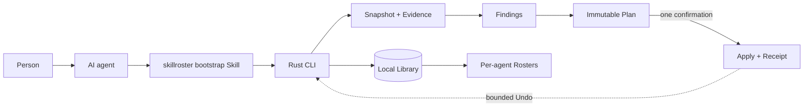

<p align="center">
  
</p>

<p align="center">
  <a href="README.md">中文</a> · <strong>English</strong>
</p>

<h1 align="center">Keep the Skills. Curate what each agent sees.</h1>

<p align="center">
  Inventory Skills across your agents, review duplicates and broken links,<br>
  and keep the rest searchable beyond each agent’s everyday essentials.<br>
  <strong>Preview every change. Approve the Plan. Undo with a Receipt.</strong>
</p>

<p align="center">
  <a href="https://github.com/tt-a1i/skillroster/releases/latest"></a>
  <a href="https://github.com/tt-a1i/skillroster/actions/workflows/ci.yml"></a>
  <a href="https://github.com/tt-a1i/homebrew-skillroster"></a>
  <a href="https://www.rust-lang.org"></a>
  <a href="LICENSE"></a>
</p>

<p align="center">
  <a href="#start-in-30-seconds">Get started</a> ·
  <a href="#when-skillroster-helps">Use cases</a> ·
  <a href="#the-governance-result-at-a-glance">See the evidence</a> ·
  <a href="docs/installation.md">Installation guide</a>
</p>

## When SkillRoster helps

You use more than one coding agent. Skills pile up in different directories, the same name starts hiding different versions, and every agent sees capabilities you only need occasionally. SkillRoster gives your agent the local facts to propose a setup you can review.

| Your situation | Ask your agent | What you get |
| --- | --- | --- |
| **Skills scattered across agents** | “Find duplicate Skills, broken links, and same-name versions.” | An inventory with paths and evidence to inspect before choosing what to keep. |
| **Too many default Skills** | “Help me choose the everyday Skills for Codex; keep the rest available on demand.” | A per-agent Roster Plan with the proposed exposure changes for your review. |
| **Cleanup feels risky** | “Show me what will change and how I can undo it.” | A complete Plan before any Agent-file change, followed by a verified Receipt and bounded Undo. |

**One Library, different Rosters.** Your Library is the logical collection of known Skills; each Roster is an agent’s curated view. Canonical files can stay where they are. The banner illustrates possible selections, not prescribed roles for Codex, Claude Code, or Pi.

## Start in 30 seconds

Install with Homebrew on macOS or Linux:

```bash
brew install tt-a1i/skillroster/skillroster
skillroster --version
```

Then give your agent this request:

> Use SkillRoster to inspect my local Skills. Explain the three most important problems, with evidence, and propose a cleanup Plan I can review. Do not change Agent files until I approve the complete Plan.

Your first step is read-only. You can also inspect the inventory directly:

```bash
skillroster scan --summary
skillroster report
```

[Windows, Cargo, and release archives](docs/installation.md) · [Upgrade and verify the executable your agent uses](docs/installation.md#upgrade-and-verify-the-executable-your-agent-uses)

## The governance result at a glance

On the same deterministic 120-Skill inventory, the public CLI acceptance path
actually runs Scan, Report, Plan, Apply, and Undo instead of loading prepared
results:

| Controlled arm | Default exposure | Duplicate placements | Verifiable recovery |
| --- | ---: | ---: | --- |
| Unmanaged | 200 | 80 | None |
| Careful manual governance | 64 | 10 | No Receipt |
| After SkillRoster Apply | **36** | **0** | Receipt verified; Undo restored the Agent tree byte-for-byte (200 / 80) |

This shows that SkillRoster can reduce default exposure, remove duplicate
placements in this inventory, keep On-demand retrieval, and bind the change to
a verified, reversible Receipt. The complete three-arm procedure, including the
careful-manual control, is in the [repeatable acceptance record](docs/acceptance.md#executed-three-arm-value-comparison).

This is controlled-inventory product evidence. It does not prove token or labor
savings, production performance, model quality, or universally superior Core
and On-demand choices.

A historical [read-only scan of a real environment](docs/acceptance/release-v1.8.28-candidate.md) also records 252 independent Skills across 892 placements. Its session coverage was incomplete: missing usage evidence is not proof that a Skill is unused.

## How it works



Three ideas keep the model simple:

| Concept | Meaning |
| --- | --- |
| **Library** | The complete logical collection of known local Skills. |
| **Roster** | The curated view exposed to one agent; it is not another copy of the Library. |
| **On-demand Skill** | A valid Skill omitted from default exposure but retained for local search and exact loading. |

The primary caller is an agent. Semantic judgment stays with the model; identity,
filesystem boundaries, persistence, validation, and mutation stay with the CLI.

<details>
<summary>CLI reference for Agent integrations</summary>

```bash
# Observe
skillroster scan --summary --json
skillroster report --findings --limit 20 --json

# Retrieve one complete, fingerprint-verified Skill
skillroster find --load --limit 1 --json -- "review this pull request"

# Preview bootstrap installation across detected agents
skillroster setup --json

# Review and execute an Agent-authored governance decision
skillroster plan --stdin --json
skillroster plan --show <plan-id> --json
skillroster apply <plan-id> --json
skillroster undo <receipt-id> --json

# Inspect recovery and retained local state
skillroster status --json
```

The CLI also supports Finding drilldown, exact same-name variants, confirmed
source roots, lifecycle export and retention controls. Read the
[product specification](docs/product-spec.md) for the complete contract and the
[local data lifecycle](docs/local-data-lifecycle.md) before purging history.

</details>

## Safety is product behavior

- **Read-only first.** Scan, Report, Find, Setup preview, and Status do not
  modify Agent files.
- **Evidence before action.** A Finding describes an observed condition; it
  never authorizes a change by itself.
- **One explicit confirmation.** The agent explains one complete Plan before
  Apply.
- **Fail closed on drift.** Changed, ambiguous, unreadable, or unsupported
  targets block mutation instead of producing a partial success.
- **Receipts and recovery.** Every successful mutation is journaled, verified,
  and bounded by an Undo Receipt.
- **Local by default.** Inventory, fingerprints, bounded usage observations,
  Plans, and Receipts stay on the machine; raw conversation text is not stored.

## Supported local agents

| Codex | Claude Code | Pi | OpenCode |
| :---: | :---: | :---: | :---: |
| ✓ | ✓ | ✓ | ✓ |

| Hermes | Cursor | Gemini CLI | GitHub Copilot |
| :---: | :---: | :---: | :---: |
| ✓ | ✓ | ✓ | ✓ |

Support is capability-aware: discovery does not imply that every harness allows
the same activation or mutation mechanism. SkillRoster reports those boundaries
instead of pretending the adapters are interchangeable.

## Project status

The current public release is **v1.8.45**. The local governance loop covers discovery, reporting, search, planning, Apply/Undo, recovery, and eight direct Agent adapters. Published artifacts and controlled acceptance are documented separately from independent-user evidence.

- [Latest release](https://github.com/tt-a1i/skillroster/releases/latest)
- [v1.8.45 release and platform evidence](docs/acceptance/release-v1.8.45-candidate.md)
- [Acceptance ledger](docs/acceptance.md)
- [Product brief](docs/product-brief.md)
- [Canonical vocabulary](CONTEXT.md)

## Development

Rust 1.85 or newer is required.

```bash
cargo fmt --check
cargo test
cargo clippy --all-targets --all-features -- -D warnings
cargo run -- --help
```

Core logic and high-risk mutation boundaries are tested. See
[AGENTS.md](AGENTS.md) for repository conventions.

## License

SkillRoster is available under the [Apache License 2.0](LICENSE).
