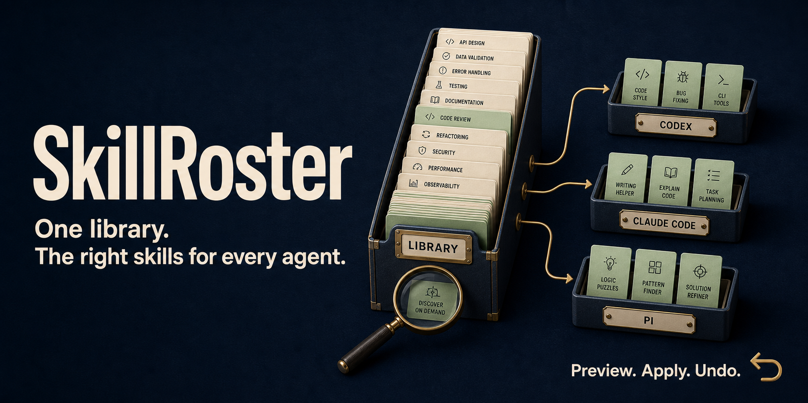
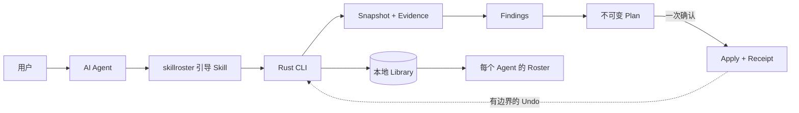

<p align="center">
  
</p>

<p align="center">
  <strong>中文</strong> · <a href="README.en.md">English</a>
</p>

<h1 align="center">Skill 都留着，每个 Agent 只带上合适的。</h1>

<p align="center">
  盘清散落的 Skills，找出重复版本和失效链接，<br>
  为每个 Agent 配好常用能力，其余按需查找。<br>
  <strong>先看方案，再确认变更；执行有凭据，整理可撤销。</strong>
</p>

<p align="center">
  <a href="https://github.com/tt-a1i/skillroster/releases/latest"></a>
  <a href="https://github.com/tt-a1i/skillroster/actions/workflows/ci.yml"></a>
  <a href="https://github.com/tt-a1i/homebrew-skillroster"></a>
  <a href="https://www.rust-lang.org"></a>
  <a href="LICENSE"></a>
</p>

<p align="center">
  <a href="#30-秒开始">立即开始</a> ·
  <a href="#什么时候用-skillroster">使用场景</a> ·
  <a href="#一眼看懂治理结果">实际效果</a> ·
  <a href="docs/installation.md">安装指南</a>
</p>

## 什么时候用 SkillRoster

你同时用着几个编程 Agent，Skill 越装越多：同一个能力分散在几个目录，同名文件不一定是同一版本，偶尔才用的能力也挂在默认列表里。SkillRoster 先把本地事实查清楚，让 Agent 提出一份你能判断、能撤销的整理方案。

| 你的场景 | 可以这样告诉 Agent | 你会得到什么 |
| --- | --- | --- |
| **几个 Agent，Skills 散得到处都是** | “查查哪些重复了、链接坏了、同名但版本不同。” | 带路径和证据的清单，先看清楚再决定保留哪份。 |
| **默认能力太多，想精简又怕丢能力** | “帮我挑出 Codex 常用的 Skills，其余保留为按需查找。” | 按 Agent 规划的 Roster，以及整理前后的暴露变化，供你确认。 |
| **想整理目录，又怕改坏现有环境** | “先告诉我会改哪些地方，以及怎么撤销。” | 变更前的完整 Plan、执行后的验证凭据 Receipt，以及有边界的 Undo。 |

**一个 Library，各自的 Roster。** Library 是已知 Skills 的逻辑全集，Roster 是某个 Agent 可见的精选视图；原始文件可以留在原处。宣传图中的能力搭配仅作示意，不代表 Codex、Claude Code 或 Pi 必须承担特定任务。

## 30 秒开始

macOS 或 Linux 用户可通过 Homebrew 安装：

```bash
brew install tt-a1i/skillroster/skillroster
skillroster --version
```

然后把这段话交给你的 Agent：

> 使用 SkillRoster 检查我电脑上的 Skills。先解释最值得处理的三个问题和对应证据，再给我一份可以审阅的整理方案。在我确认完整 Plan 之前，不要修改 Agent 文件。

第一步只做检查。你也可以直接在终端查看：

```bash
skillroster scan --summary
skillroster report
```

[Windows、Cargo 和 Release 安装方式](docs/installation.md) · [升级并确认 Agent 使用的可执行文件](docs/installation.md#upgrade-and-verify-the-executable-your-agent-uses)

## 一眼看懂治理结果

在同一份确定性的 120-Skill 清单上，公开 CLI 验收会实际执行 Scan、Report、Plan、
Apply 和 Undo，而不是加载预先写好的结果：

| 受控场景 | 默认暴露 | 重复 Placement | 可验证恢复 |
| --- | ---: | ---: | --- |
| 未治理 | 200 | 80 | 无 |
| 谨慎人工治理 | 64 | 10 | 无 Receipt |
| SkillRoster Apply 后 | **36** | **0** | Receipt 验证；Undo 按字节恢复 Agent tree（200 / 80） |

这说明 SkillRoster 能在保留 On-demand 检索的同时减少默认暴露、消除这份清单中的重复
Placement，并把变更限制在可验证、可撤销的 Receipt 内。完整的三臂过程（包含谨慎人工
治理对照）见[可重复验收记录](docs/acceptance.md#executed-three-arm-value-comparison)。

这是受控清单上的产品行为证据，不是对 token、人工成本、生产性能、模型质量，或
Core / On-demand 划分普遍优越性的证明。

另有一份[真实环境的历史只读记录](docs/acceptance/release-v1.8.28-candidate.md)：252 个独立 Skills、892 个安装位置。那次会话覆盖不完整；没有观察到使用记录，不代表某个 Skill 没有用。

## 工作原理



整个模型建立在三个概念上：

| 概念 | 含义 |
| --- | --- |
| **Library** | SkillRoster 已知的全部本地 Skill，是一份逻辑集合。 |
| **Roster** | 暴露给某个 Agent 的精选视图，不是 Library 的又一份副本。 |
| **On-demand Skill** | 不占用默认暴露，但仍可在本地检索并精确加载的有效 Skill。 |

主要调用者是 Agent。语义判断交给模型；身份识别、文件系统边界、持久化、校验和变更
执行交给 CLI。

<details>
<summary>Agent 集成：展开查看 CLI 主流程</summary>

```bash
# 观察
skillroster scan --summary --json
skillroster report --findings --limit 20 --json

# 检索并完整加载一份经过指纹校验的 Skill
skillroster find --hint "review a Pull Request on GitHub" --load --limit 1 --json -- "审查这个 Pull Request"

# 预览为已检测 Agent 安装引导 Skill 的方案
skillroster setup --json

# 检查并执行由 Agent 编写的治理决策
skillroster plan --stdin --json
skillroster plan --show <plan-id> --json
skillroster apply <plan-id> --json
skillroster undo <receipt-id> --json

# 检查恢复状态和保留在本地的数据
skillroster status --json
```

CLI 还支持 Finding 下钻、同名不同内容的精确选择、已确认的 Source Root，以及生命周期
导出和保留策略。完整契约见[产品规范](docs/product-spec.md)。清理历史记录前，请先阅读
[本地数据生命周期](docs/local-data-lifecycle.md)。

</details>

## 安全约束

- **默认只读。** Scan、Report、Find、Setup 预览和 Status 都不会修改 Agent 文件。
- **先看证据。** Finding 只描述观察到的情况，本身不授权任何变更。
- **一次明确确认。** Agent 先解释完整 Plan，再执行 Apply。
- **发现漂移就停止。** 目标发生变化、存在歧义、无法读取或不受支持时，直接阻止变更，
  不会返回一个看似成功的残缺结果。
- **Receipt 与恢复。** 每次成功变更都会写入 journal、完成校验，并提供有边界的 Undo。
- **数据默认留在本地。** Inventory、指纹、有限的使用观察、Plan 和 Receipt 保存在本机，
  不存储原始会话文本。

## 支持的本地 Agent

| Codex | Claude Code | Pi | OpenCode |
| :---: | :---: | :---: | :---: |
| ✓ | ✓ | ✓ | ✓ |

| Hermes | Cursor | Gemini CLI | GitHub Copilot |
| :---: | :---: | :---: | :---: |
| ✓ | ✓ | ✓ | ✓ |

支持范围会按能力区分。能被发现，不等于对应 harness 一定允许相同的激活或变更方式。
SkillRoster 会报告这些边界，不会假设所有 Adapter 都一样。

## 项目状态

当前公开版本为 **v1.8.45**，已覆盖发现、报告、检索、规划、Apply/Undo、恢复和 8 个直接 Agent Adapter。发布产物、受控验收与独立用户使用证据分别记录。

- [最新版本](https://github.com/tt-a1i/skillroster/releases/latest)
- [v1.8.45 发布与平台证据](docs/acceptance/release-v1.8.45-candidate.md)
- [验收记录](docs/acceptance.md)
- [产品简介](docs/product-brief.md)
- [统一术语](CONTEXT.md)

## 开发

需要 Rust 1.85 或更高版本。

```bash
cargo fmt --check
cargo test
cargo clippy --all-targets --all-features -- -D warnings
cargo run -- --help
```

测试集中覆盖核心逻辑和高风险变更边界。仓库约定见 [AGENTS.md](AGENTS.md)。

## 许可证

SkillRoster 使用 [Apache License 2.0](LICENSE)。
