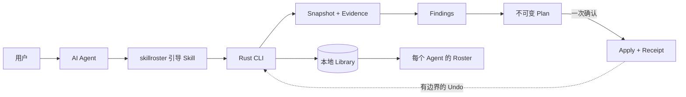

<h1 align="center">SkillRoster</h1>

<p align="center">
  <strong>中文</strong> · <a href="README.en.md">English</a>
</p>

<p align="center">
  <strong>别把所有 Skill 都塞给每个 Agent。</strong>
</p>

<p align="center">
  SkillRoster 统一盘点散落在不同 Agent 里的 Skills，<br>
  为每个 Agent 保留合适的默认能力，其他能力按需查找；文件整理先预览，执行后可撤销。<br>
  一个 Library，为每个 Agent 配好合适的 Roster。
</p>

<p align="center">
  <a href="https://github.com/tt-a1i/skillroster/releases/latest"></a>
  <a href="https://github.com/tt-a1i/skillroster/actions/workflows/ci.yml"></a>
  <a href="https://github.com/tt-a1i/homebrew-skillroster"></a>
  <a href="https://www.rust-lang.org"></a>
  <a href="LICENSE"></a>
</p>

<p align="center">
  <a href="#30-秒开始">快速开始</a> ·
  <a href="#它能看见什么">实际效果</a> ·
  <a href="#工作原理">工作原理</a> ·
  <a href="docs/product-spec.md">产品规范</a> ·
  <a href="docs/installation.md">全部安装方式</a>
</p>

---

## Skill 越装越多，Agent 不该越用越乱

Codex、Claude Code、Pi、OpenCode、Hermes、Cursor、Gemini CLI 和 GitHub
Copilot 用久了，Skill 会散落在不同目录：同一个能力到处复制，版本逐渐不一致，
链接失效，名字相同但内容不同。与此同时，一些很少用到的 Skill 仍占着每个 Agent
的默认上下文，真正需要的能力反而更难选中。

人工整理同样危险：你很难确定哪些正在使用、哪些只是没有观察到，也很难保证移动、
替换或删除之后还能恢复。SkillRoster 先用确定性的本地 CLI 把事实查清楚，再让 Agent
提出方案；没有完整 Plan 和用户确认，就不会修改 Agent 文件。

| 看得清 | 配得准 | 改得回 |
| --- | --- | --- |
| 盘点 Skill、Placement、链接、来源、暴露范围和有边界的使用证据。 | 为每个 Agent 保留合适的 Core Skill，较窄的能力转为可检索的 On-demand Skill。 | 先预览不可变 Plan，确认后执行，留下 Receipt，需要时 Undo。 |

> **核心价值：让多个 Agent 的 Skill 环境从不可见、不可控，变成看得清、配得准、改得回。**

SkillRoster 不提供 Marketplace，也不调用模型或运行 MCP Server。AI Agent 负责理解
你的意图；SkillRoster 负责返回有边界的事实，并执行已经批准的变更。

### 一眼看懂治理结果

在同一份确定性的 120-Skill 清单上，公开 CLI 验收会实际执行 Scan、Report、Plan、
Apply 和 Undo，而不是加载预先写好的结果：

| 受控场景 | 默认暴露 | 重复 Placement | 可验证恢复 |
| --- | ---: | ---: | --- |
| 未治理 | 200 | 80 | 无 |
| 谨慎人工治理 | 64 | 10 | 无 Receipt |
| SkillRoster Apply 后 | **36** | **0** | Receipt 验证；Undo 按字节恢复 Agent tree（200 / 80） |

这说明 SkillRoster 能在保留 On-demand 检索的同时减少默认暴露、消除这份清单中的重复
Placement，并把变更限制在可验证、可撤销的 Receipt 内。完整的三臂过程（包含谨慎人工
治理对照）见[可重复验收记录](docs/acceptance.md#executed-three-arm-value-comparison)。

这是受控清单上的产品行为证据，不是对 token、人工成本、生产性能、模型质量，或
Core / On-demand 划分普遍优越性的证明。

## 30 秒开始

使用 Homebrew 安装当前版本：

```bash
brew install tt-a1i/skillroster/skillroster
skillroster --version
```

然后直接告诉你的 Agent：

> 使用 SkillRoster 检查我电脑上的 Skills，解释最需要处理的问题，并给出一套更安全的
> 整理方案。在我确认完整 Plan 之前，不要修改任何文件。

也可以先在终端运行：

```bash
skillroster scan --summary
skillroster report
```

Agent 调用时加上 `--json`，即可得到一份稳定的机器可读结果。Release 压缩包、Cargo、
Windows 安装和校验和验证请看[安装文档](docs/installation.md)。

## 它能看见什么

下面是 v1.8.28 在一台真实电脑上的只读 dogfood 结果。它只代表当时不断变化的本地
Skill 环境，不是性能基准，也不代表所有用户都会有相同规模：

```text
SkillRoster · Report

  Independent Skills     252
  Placements             892
  Default exposure       525
  Observed-use Agents    3
  Session sample         sampled 5/8 · complete 0/8

  Top Findings
  high    layout     Skill links escape an approved root
  medium  exposure   Large default Rosters need review
  medium  overlap    Exact duplicate Skill placements

Read-only · no Agent files changed
Review evidence before planning changes
```

这份结果同时写出了证据边界。覆盖不完整时，SkillRoster 会把限制放进结果，不会因为
没有观察到使用记录，就断言某个 Skill “从未使用”。完整数据见
[v1.8.28 发布验收记录](docs/acceptance/release-v1.8.28-candidate.md)。

## 工作原理



整个模型建立在三个概念上：

| 概念 | 含义 |
| --- | --- |
| **Library** | SkillRoster 已知的全部本地 Skill，是一份逻辑集合。 |
| **Roster** | 暴露给某个 Agent 的精选视图，不是 Library 的又一份副本。 |
| **On-demand Skill** | 不占用默认暴露，但仍可在本地检索并精确加载的有效 Skill。 |

主要调用者是 Agent。语义判断交给模型；身份识别、文件系统边界、持久化、校验和变更
执行交给 CLI。

## Agent 的主流程

```bash
# 观察
skillroster scan --summary --json
skillroster report --findings --limit 20 --json

# 检索并完整加载一份经过指纹校验的 Skill
skillroster find --load --limit 1 --json -- "审查这个 Pull Request"

# 预览为已检测 Agent 安装引导 Skill 的方案
skillroster setup --json

# 检查并执行由 Agent 编写的治理决策
skillroster plan --stdin --json
skillroster plan --show <plan-id> --json
skillroster apply <plan-id> --json
skillroster undo <receipt-id> --json

# 检查恢复状态和保留在本地的数据
skillroster status --json
```

CLI 还支持 Finding 下钻、同名不同内容的精确选择、已确认的 Source Root，以及生命周期
导出和保留策略。完整契约见[产品规范](docs/product-spec.md)。清理历史记录前，请先阅读
[本地数据生命周期](docs/local-data-lifecycle.md)。

## 安全约束

- **默认只读。** Scan、Report、Find、Setup 预览和 Status 都不会修改 Agent 文件。
- **先看证据。** Finding 只描述观察到的情况，本身不授权任何变更。
- **一次明确确认。** Agent 先解释完整 Plan，再执行 Apply。
- **发现漂移就停止。** 目标发生变化、存在歧义、无法读取或不受支持时，直接阻止变更，
  不会返回一个看似成功的残缺结果。
- **Receipt 与恢复。** 每次成功变更都会写入 journal、完成校验，并提供有边界的 Undo。
- **数据默认留在本地。** Inventory、指纹、有限的使用观察、Plan 和 Receipt 保存在本机，
  不存储原始会话文本。

## 支持的本地 Agent

| Codex | Claude Code | Pi | OpenCode |
| :---: | :---: | :---: | :---: |
| ✓ | ✓ | ✓ | ✓ |

| Hermes | Cursor | Gemini CLI | GitHub Copilot |
| :---: | :---: | :---: | :---: |
| ✓ | ✓ | ✓ | ✓ |

支持范围会按能力区分。能被发现，不等于对应 harness 一定允许相同的激活或变更方式。
SkillRoster 会报告这些边界，不会假设所有 Adapter 都一样。

## 项目状态

公开版本 v1.8.38 已实现完整的本地治理闭环；每一步 Agent 续接都会绑定到
生成该续接指令的 SkillRoster 可执行文件，不会被 `PATH` 中的旧版本静默接管。
能力包括发现、标准化 Inventory、保守的
使用证据、有边界的报告、本地检索、不可变 Plan、Apply/Undo、恢复、生命周期控制，
以及 8 个直接 Agent Adapter。

- [最新版本](https://github.com/tt-a1i/skillroster/releases/latest)
- [v1.8.38 发布与平台证据](docs/acceptance/release-v1.8.38-candidate.md)
- [验收记录](docs/acceptance.md)
- [产品简介](docs/product-brief.md)
- [统一术语](CONTEXT.md)

## 开发

需要 Rust 1.85 或更高版本。

```bash
cargo fmt --check
cargo test
cargo clippy --all-targets --all-features -- -D warnings
cargo run -- --help
```

测试集中覆盖核心逻辑和高风险变更边界。仓库约定见 [AGENTS.md](AGENTS.md)。

## 许可证

SkillRoster 使用 [Apache License 2.0](LICENSE)。
